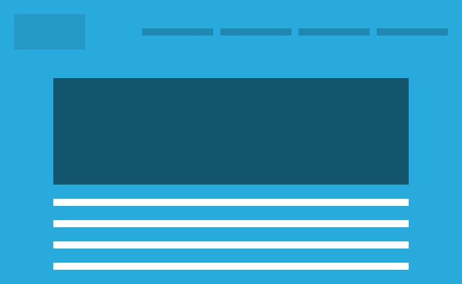
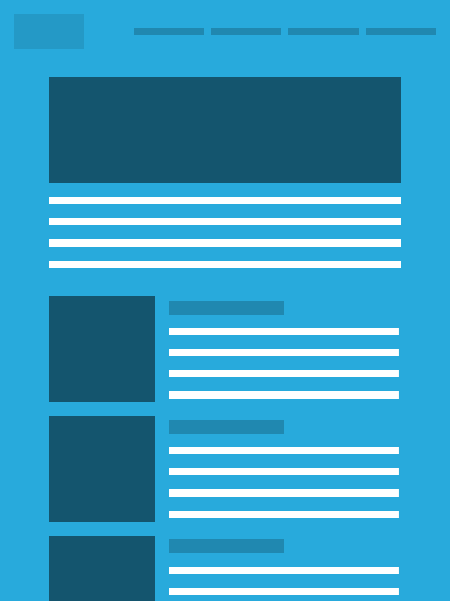
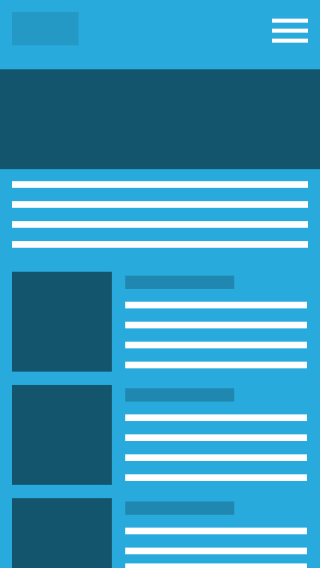

# CSS Device Mockups

In this project, I created some fun and simple device mockups made with plain old CSS. Devices include a desktop browser, a tablet, and a mobile phone. They are all created using a single CSS element.

## Desktop Browser

The desktop browser features a close button, minimise button, expand button, and a url bar. Url's are captured and displayed using the `data-url` attribute in the markup and CSS. The demo uses a 13:8 aspect ratio image, but you are free to use whatever size you want. The browser takes up 100% width, unless a maximum width is specified. Example usage:

```html
<div class="css-device css-device--browser" data-url="http://callmenick.com">
  
</div>
```

## Tablet

The tablet mockup features a home button (like that of the iPad), and a camera pinhole. The demo uses a 4:3 aspect ratio image, but you are free to use whatever size you want. The tablet mockup occupies a maximum width of 360px, but this can be changed easily in the media queries. If you're using Sass, then it's easily editable in the Sass files. Just change up the scaling factor for bigger media queries. Example usage:

```html
<div class="css-device css-device--tablet">
  
</div>
```

## Mobile

The mobile mockup features a home button (like that of the iPhone), and two volume buttons on the left. The demo uses a 16:9 aspect ratio image, but you are free to use whatever size you want. The mobile mockup occupies a maximum width of 240px, but this can be changed easily in the media queries. If you're using Sass, then it's easily editable in the Sass files. Just change up the scaling factor for bigger media queries. Example usage:

```html
<div class="css-device css-device--mobile">
  
</div>
```

## Live Demo

You can check out the CSS devices in action [right here.](http://callmenick.com/_development/css-device-mockups/)

## License & Copyright

Licensed under the [MIT license.](http://www.opensource.org/licenses/mit-license.php)

Copyright 2014, [Call Me Nick.](http://callmenick.com)